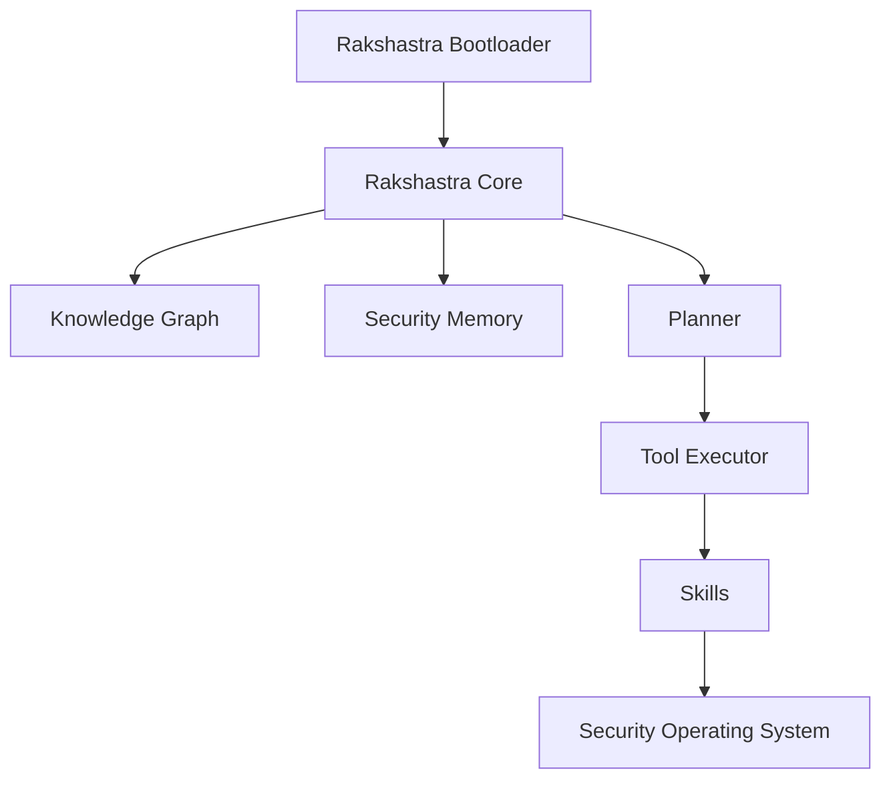

This is a [Next.js](https://nextjs.org) project bootstrapped with [`create-next-app`](https://nextjs.org/docs/app/api-reference/cli/create-next-app).

## Getting Started

First, run the development server:

```bash
npm run dev
# or
yarn dev
# or
pnpm dev
# or
bun dev
```

Open [http://localhost:3000](http://localhost:3000) with your browser to see the result.

You can start editing the page by modifying `app/page.tsx`. The page auto-updates as you edit the file.

This project uses [`next/font`](https://nextjs.org/docs/app/building-your-application/optimizing/fonts) to automatically optimize and load [Geist](https://vercel.com/font), a new font family for Vercel.

## Learn More

To learn more about Next.js, take a look at the following resources:

- [Next.js Documentation](https://nextjs.org/docs) - learn about Next.js features and API.
- [Learn Next.js](https://nextjs.org/learn) - an interactive Next.js tutorial.

You can check out [the Next.js GitHub repository](https://github.com/vercel/next.js) - your feedback and contributions are welcome!

## Deploy on Vercel

The easiest way to deploy your Next.js app is to use the [Vercel Platform](https://vercel.com/new?utm_medium=default-template&filter=next.js&utm_source=create-next-app&utm_campaign=create-next-app-readme) from the creators of Next.js.

Check out our [Next.js deployment documentation](https://nextjs.org/docs/app/building-your-application/deploying) for more details.
# Rakshastra ☤

> **The Autonomous Security Engineer for SMEs**  
> *The AI Security Operating System for Modern Businesses*

---

## Problem

Small and Medium Enterprises (SMEs) face critical cybersecurity challenges:
- **No Dedicated SOCs**: Most SMEs cannot afford 24/7 Security Operations Centers.
- **Prohibitive Costs**: Enterprise-grade security suites are expensive and complex to configure.
- **Skilled Talent Shortage**: Cybersecurity talent is scarce, leaving SMEs vulnerable to targeted attacks, ransomware, and compliance violations.

---

## Vision

Rakshastra acts as an **Autonomous Security Operating System for Modern Businesses**—providing continuous threat identification, automated compliance audits, and intelligent configuration hardening without requiring a dedicated security team.

---

## Architecture

Rakshastra is built on a structured execution stack, transforming raw model inference into a robust security daemon:



- **Rakshastra Bootloader**: Initializes environment context, active profiles, and core dependencies.
- **Rakshastra Core**: Orchestrates conversation, manages agent iterations, and drives the reasoning loop.
- **Knowledge Graph**: Maps enterprise digital assets, dependencies, and network topology.
- **Security Memory**: Persists security history, incident trails, and past system states using FTS5 search.
- **Planner**: Generates step-by-step diagnostic actions, schedules scans, and designs mitigation strategies.
- **Tool Executor**: Safely runs system commands, executes diagnostic scripts, and navigates environments.
- **Skills**: Encapsulates playbooks, compliance guidelines, and security verification procedures.
- **Security Operating System**: The unified, self-healing outcome providing continuous protection.

---

## Features

- **Continuous Vulnerability Assessment**: Periodically scans systems, code repos, and ports.
- **Isolated Execution Sandboxing**: Executes diagnostic tools within sandboxed Docker/SSH containers to prevent damage.
- **Closed Learning Loop**: Autonomously extracts new security playbooks and refines existing skills after resolving incidents.
- **Multi-Platform Security Gateway**: Sends real-time threat alerts and receives commands via Telegram, Discord, Slack, and WhatsApp.
- **Cron Scheduling**: Automates daily posture checks, weekly compliance reports, and regular backup validation.

---

## Roadmap

- [ ] **Security Knowledge Graph**: Integrate CVE mappings and live dependency graphs.
- [ ] **Expanded Toolset**: Package masscan, nmap, and OWASP ZAP wrapper integrations.
- [ ] **Autonomous Mitigation**: Implement automated hot-patching and security group configuration.
- [ ] **Compliance Engine**: Built-in support for automated SOC2, HIPAA, and ISO27001 audits.

---

## Folder Structure

- [`agent/`](agent): Core agent logic, memory consolidation, and reasoning.
- [`tools/`](tools): Tool wrappers for terminal backends (Docker, local, SSH), browser automation, and web searching.
- [`skills/`](skills): Predefined security skills, checklists, and compliance templates.
- [`optional-skills/`](optional-skills): Specialized but inactive skills for custom security scenarios.
- [`gateway/`](gateway): Platform integrations (Slack, Telegram, Discord, Signal) for notification and remote control.
- [`cli.py`](cli.py): Interactive command-line client.
- [`Dockerfile`](Dockerfile), [`docker-compose.yml`](docker-compose.yml): Deployment configurations.

---

## Developer Guide

### Setup

Install the dependencies and set up the development environment:

```bash
uv pip install -e ".[all,dev]"
```

Run tests to verify the setup:

```bash
scripts/run_tests.sh
```

### Contributing

See [AGENTS.md](AGENTS.md) for contribution guidelines, core invariants, and design principles.
