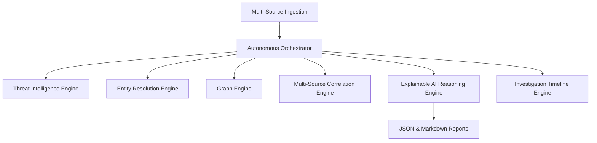

# Rakshastra ☤

> **Autonomous AI-Powered Cyber Investigation Platform**  
> *The Gemini-First Security Operating System with Algorand-backed x402 Pay-Per-Request APIs*

---

## What is Rakshastra?

Rakshastra is an autonomous AI-native threat intelligence and investigation platform built to identify, resolve, and explain cyber threats across modern corporate communication channels. It acts as an autonomous cyber investigator, analyzing multi-source footprints (Telegram, WhatsApp, Discord, Email, screenshots, and PDFs), mapping actor connection graphs, and generating explainable intelligence reports.

---

## Key Pillars

### 1. Gemini-First Core Reasoning
Rakshastra is built from the ground up for the **Google Gemini** family of models, utilizing its massive context window and advanced reasoning capabilities to perform structured cyber defense operations.

### 2. Multi-Source Correlation
Correlates indicators (phones, wallet addresses, handles, domains, URLs, invitation links) across separate channels and platforms (WhatsApp, Discord, Telegram, Email, and OCR images) to detect infrastructure reuse and identify threat operator profiles.

### 3. Explainable AI (XAI)
Generates human-readable markdown reports and structured JSON detailing:
- Executive summaries of threat alerts.
- Logical step-by-step reasoning chains.
- Counter-evidence/gaps explaining confidence scores.
- Actionable investigator recommendations.

### 4. x402 Pay-Per-Request payment architecture
Supports Algorand-based payment verification hooks for pay-per-request API monetization, enabling secure, decentralised billing for production-grade threat lookup and intelligence endpoints.

### 5. Windows Desktop Companion App
Integrates with a native Windows app distributed via `winget` for local scanning, credential loading, and offline/on-premise deployment.

---

## System Architecture



- **Autonomous Orchestrator**: Case Goal Planner, Dynamic Task Planning, and Evidence Collection Queue.
- **Threat Intelligence Engine**: Modular intelligence packs for scam, crypto fraud, and phishing detection.
- **Entity Resolution Engine**: Resolves identities, groups aliases, and extracts indicators.
- **Graph Engine**: Visualizes relationships with force-directed layouts.
- **Multi-Source Correlation Engine**: Tracks identifier reuse and matches across history.
- **Explainable AI Reasoning Engine**: Synthesizes structured data into investigator-friendly narratives.
- **Investigation Timeline Engine**: Chronological step replay and state reconstruction.

---

## Installation & Setup

### Requirements
- Python 3.10+
- Node.js (for Vite web dashboard)
- Google Gemini API Key

### Backend Setup
1. Clone the repository and navigate to the project root:
   ```bash
   git clone https://github.com/username/rakshastra.git
   cd rakshastra
   ```
2. Create and activate a virtual environment:
   ```bash
   python -m venv .venv
   .venv\Scripts\activate
   ```
3. Install dependencies:
   ```bash
   pip install -e .
   ```
4. Set your Google Gemini API credential:
   ```bash
   $env:GEMINI_API_KEY="your-api-key"
   ```
5. Run the web server:
   ```bash
   python rakshastra_cli/web_server.py
   ```

### Frontend Setup
1. Navigate to the frontend directory:
   ```bash
   cd web
   ```
2. Install package dependencies:
   ```bash
   npm install
   ```
3. Run the development server:
   ```bash
   npm run dev
   ```

---

## Verification & Tests

To execute tests and verify all core engines:
```bash
python -m pytest tests/
```
