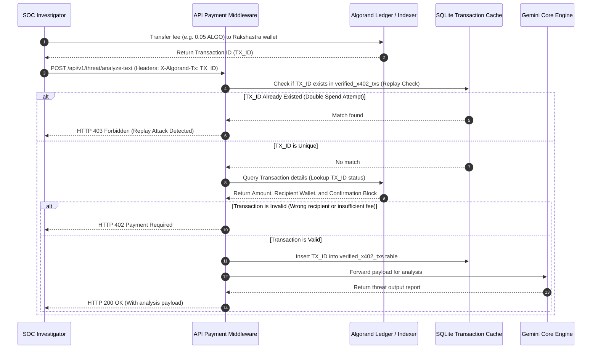

# ☤ ALGORAND X402 SPECIFICATION
> **Pay-Per-Request Micro-Billing Architecture & Smart Contract Integrations**

This document specifies the pay-per-request billing protocol deployed on the Algorand blockchain, verifying transaction fees before unlocking premium threat intelligence and entity correlation endpoints.

---

## 🚦 1. API Payment Boundaries

| Endpoint | Access Mode | Cost (ALGO) | Purpose |
| :--- | :--- | :--- | :--- |
| `GET /api/v1/health` | **Free** | `0.00` | Gateway diagnostics, heartbeat checks, and node status. |
| `POST /api/v1/threat/analyze` | **x402 Paid** | `0.05` | Direct text processing against modular threat packs. |
| `POST /api/v1/entity/correlate`| **x402 Paid** | `0.10` | Cross-platform alias extraction and correlation check. |
| `POST /api/v1/report/generate` | **x402 Paid** | `0.15` | Fully synthesized Explainable AI markdown dossier creation. |

---

## 🔄 2. Payment Verification Sequence

The API middleware acts as an inline payment check, verifying outbound blockchain transactions before routing payload packets to the Gemini-First reasoning engines.



---

## 🔒 3. Replay Protection & Ledger Indexing

To prevent transaction ID reuse across separate clients or sessions, the Rakshastra gateway runs a strict validation checks pipeline:

### A. Database Ledger Check
The database enforces uniqueness on the transaction record:
```sql
CREATE TABLE verified_x402_txs (
    tx_id TEXT PRIMARY KEY,
    amount INTEGER NOT NULL,
    sender TEXT NOT NULL,
    recipient TEXT NOT NULL,
    timestamp DATETIME DEFAULT CURRENT_TIMESTAMP
);
```

### B. Indexer Validation Criteria
The payment gateway verifies:
1. **Recipient Match**: The receiver wallet address in the transaction transaction matches the designated platform hot-wallet.
2. **Value Match**: The amount transferred matches or exceeds the required endpoint fee (e.g. `50000 microAlgos` for `/threat/analyze-text`).
3. **Age Verification**: The transaction timestamp must be within a 2-hour window of the API request to prevent caching of old transactions.
